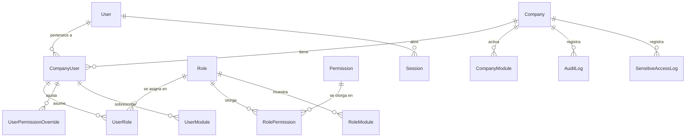
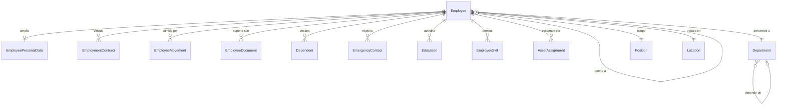
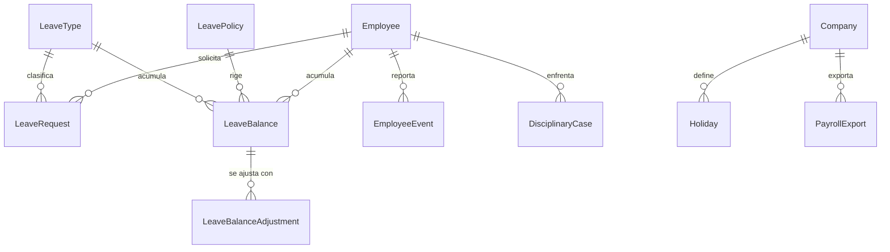
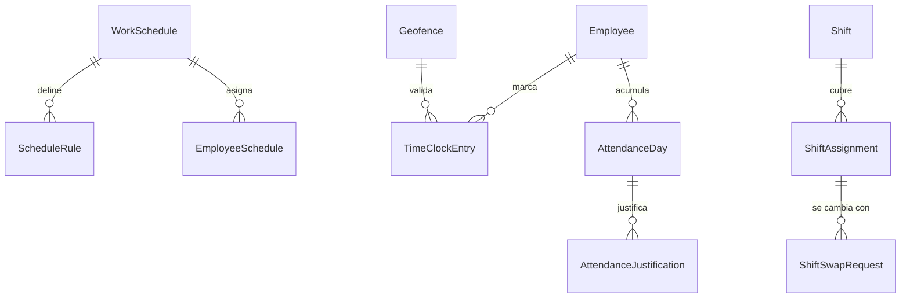
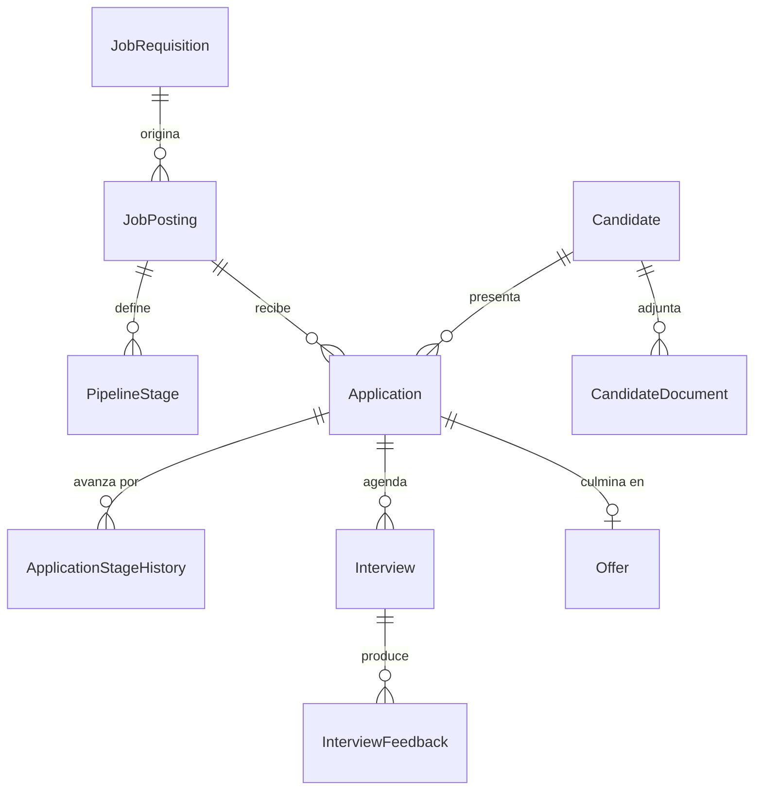
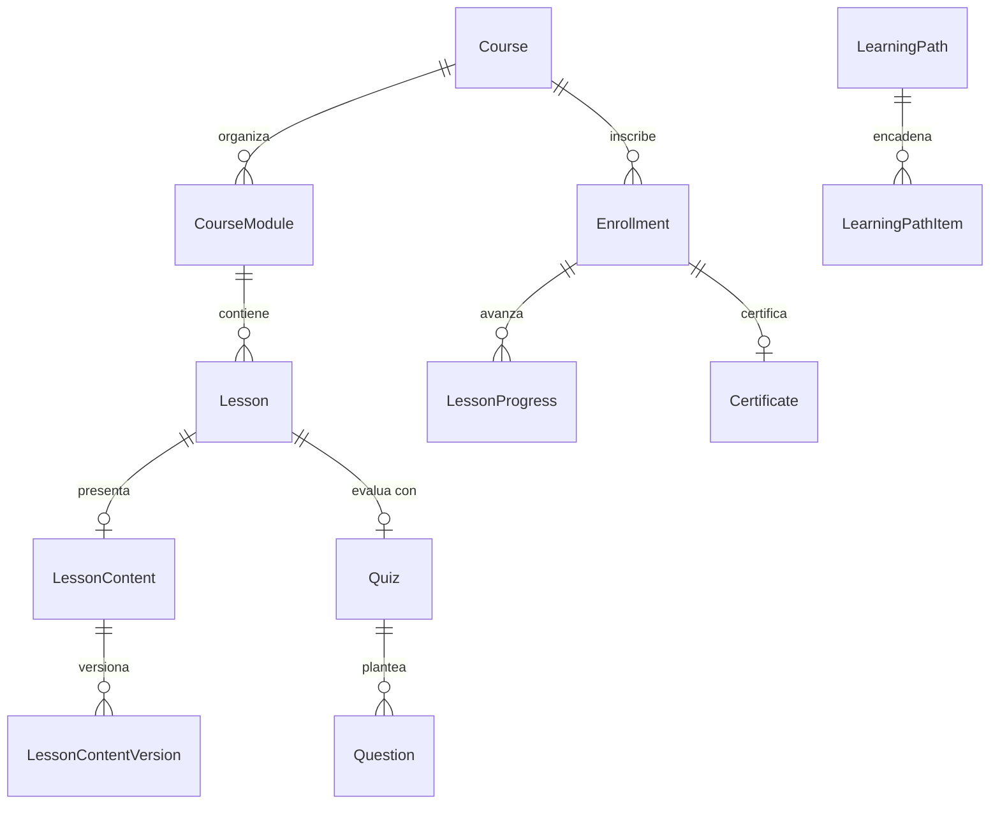
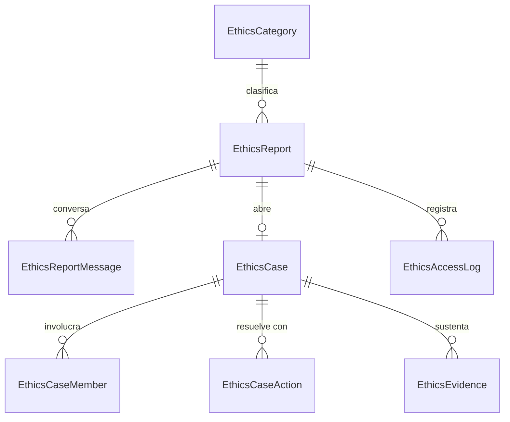
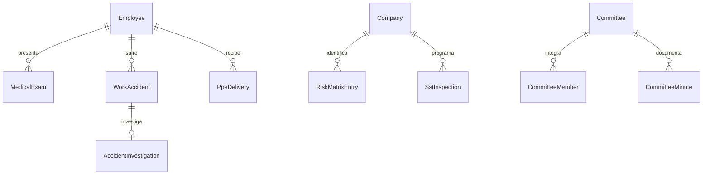

# Modelo de datos

211 tablas en PostgreSQL 17. El esquema completo esta en
[`apps/api/prisma/schema.prisma`](../apps/api/prisma/schema.prisma); aqui esta
la forma y las decisiones que no se leen en el esquema.

## Convenciones

| Convencion | Detalle |
|---|---|
| Nombres | Modelos en PascalCase singular; tablas y columnas en `snake_case` |
| Llaves | `uuid` generado con `gen_random_uuid()` |
| Multiempresa | Casi toda tabla lleva `company_id`, con indice |
| Borrado | Logico con `deleted_at`; nunca se pierde el historial |
| Auditoria | `created_at`, `updated_at`, `created_by`, `updated_by` |
| Fechas | `timestamptz`, siempre en UTC |
| Cifrado | Columnas sensibles como texto con prefijo `enc:v1:` |

`company_id` esta presente incluso donde parece redundante (por ejemplo en las
lineas de una solicitud). Eso permite que la extension de tenencia filtre sin
recorrer relaciones, y hace que un `JOIN` mal escrito no cruce empresas.

## Extensiones

| Extension | Para que |
|---|---|
| `pgcrypto` | `gen_random_uuid()` |
| `pg_trgm` | Busqueda tolerante a errores de escritura sobre nombres |
| `unaccent` | Busqueda que ignora tildes |
| `btree_gist` | Restriccion `EXCLUDE` sobre rangos de fechas de ausencias |

## Nucleo: empresa, identidad y permisos



Un usuario puede pertenecer a varias empresas: `User` es la identidad global y
`CompanyUser` la pertenencia. Los roles y permisos cuelgan de la pertenencia,
no del usuario, de modo que la misma persona puede ser administradora en una
empresa y colaboradora en otra.

La visibilidad de un modulo se resuelve en tres niveles: lo que la empresa
activa, lo que el rol muestra y lo que se sobrescribe por usuario.

## Personal



`Employee.managerId` y `Department.parentId` son autorreferencias: de ahi salen
el organigrama y los alcances `team` y `area`, que se resuelven con consultas
recursivas.

Los datos sensibles viven en tablas aparte (`EmployeePersonalData`,
`EmploymentContract`) con sus columnas cifradas, de modo que una consulta de
directorio nunca los roza.

## Ausencias y novedades



`LeaveBalance` guarda lo causado, lo tomado, lo pendiente, lo ajustado y lo
trasladado por separado. El saldo disponible no se almacena: se calcula, de modo
que no puede quedar desincronizado.

**`leave_requests` tiene una restriccion `EXCLUDE USING gist`** que impide en la
base de datos que una persona tenga dos ausencias aprobadas que se crucen. La
validacion en el servicio da un mensaje util; la restriccion cierra la ventana
entre dos solicitudes simultaneas ([ADR-0004](DECISIONS.md#adr-0004)).

`PayrollExport` guarda que novedades se entregaron y cuando. **No guarda
valores**: la plataforma clasifica y exporta, no liquida.

## Tiempo y asistencia



`TimeClockEntry` guarda la marcacion cruda y `AttendanceDay` el resultado
calculado del dia. Separarlos permite recalcular sin perder el original: si
cambia el horario o se aprueba una ausencia, el dia se recalcula y la marcacion
sigue siendo la que ocurrio.

## Seleccion



`Candidate` es independiente de `Application`: la misma persona puede postularse
a varias vacantes y permanecer en el banco de talento. La anonimizacion por
retencion actua sobre `Candidate` y conserva las estadisticas agregadas.

## Formacion



`LessonContent` guarda un documento de bloques versionado, no HTML. La misma
estructura la usan la wiki, las publicaciones, las politicas y las plantillas de
documentos.

## Etica



**Lo importante de este modelo es lo que no tiene.** `EthicsReport` no incluye
`ip_address`, `user_agent` ni `created_by`. El anonimato no depende de que el
codigo evite escribir esos campos: no existen. Una prueba e2e consulta
`information_schema` para verificarlo.

`accessKeyHash` guarda el hash de la clave de seguimiento, nunca la clave.
Asunto, descripcion y mensajes van cifrados.

## Seguridad y salud en el trabajo



Las restricciones y recomendaciones de `MedicalExam` van cifradas: son datos de
salud.

## Motores transversales

| Tabla | Para que |
|---|---|
| `workflow_definitions` · `workflow_instances` | Aprobaciones de cualquier entidad, por `(entityType, entityId)` |
| `dynamic_forms` · `form_versions` · `form_submissions` | Formularios de encuestas, evaluaciones e inspecciones |
| `stored_files` · `file_links` | Archivos y su vinculo con cualquier entidad |
| `notifications` · `notification_deliveries` | Notificaciones y su entrega por canal |
| `catalog_items` | Listas configurables por la empresa |
| `custom_field_definitions` · `custom_field_values` | Campos adicionales sin migracion |
| `audit_logs` · `sensitive_access_logs` | Trazabilidad |

Que el motor de aprobaciones apunte a `(entityType, entityId)` en vez de tener
una tabla por modulo es lo que permite que una requisicion, una ausencia y un
cambio de turno compartan bandeja de aprobacion.

## Indices

Ademas de los que Prisma genera:

- GIN con `gin_trgm_ops` sobre `employees.full_name` y `candidates.full_name`,
  para busqueda tolerante a errores.
- `EXCLUDE USING gist` sobre `leave_requests`, descrito arriba.
- Compuestos por `(company_id, ...)` en las tablas de alto volumen.

## Migraciones

```bash
pnpm db:migrate                      # desarrollo
pnpm --filter @talento/api exec prisma migrate deploy   # produccion
```

| Migracion | Contenido |
|---|---|
| `20260922211805_init` | Esquema completo y extensiones |
| `20260922212000_search_and_exclusion_constraints` | Indices GIN y restriccion de solapamiento |
| `20260922220600_job_posting_relations_and_audit_actions` | Relaciones de vacantes y nuevas acciones de auditoria |
